# 🎓 RHU Course Flow — Smart Course Registration Assistant

> Fill out one form. Get an AI-built, conflict-checked schedule. Revise it until it's right. Then send it to your advisor.

**RHU Course Flow** turns Rafik Hariri University's semester registration, usually a back-and-forth of emails, meetings, and schedule conflicts, into a single guided loop. A React frontend collects the student's information and study plan, and an **n8n** workflow powered by **Google Gemini** builds a proposed schedule from the live course offerings. The student reviews and revises the plan, and the advisor approves or rejects it straight from their inbox.

> Hosted at: https://course-flow-frontend-gules.vercel.app/

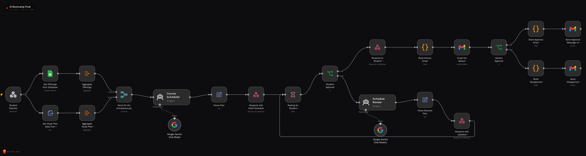

---


## 🤖 How it works

1. **The student fills out the Course Flow form.** It covers personal details, degree track and major, the target semester, their study plan as an **Excel file**, their advisor's email, courses they want, and scheduling preferences.
2. **n8n builds the plan.** The workflow reads the semester's course offerings from **Google Sheets**, extracts the student's study plan from the uploaded Excel file, and hands both to a Gemini-powered **Course Scheduler** agent. The agent returns a schedule that respects prerequisites, avoids time conflicts, and stays within the credit limit.
3. **The student reviews it.** The proposed courses appear in a table. The student can **approve** the plan or **request changes** with a reason: a time conflict, different courses, preferred times, days to avoid, credit load, or free text.
4. **Revisions loop in place.** Change requests go to a **Schedule Reviser** agent in the *same* workflow execution, so it still has the student's study plan and the offerings. The revised plan replaces the old one on the review screen. There's no limit on rounds.
5. **The student approves.** The plan is confirmed back to the frontend and emailed to the advisor as a formatted table with **Good to Go** / **Need a Meeting** buttons.
6. **The advisor decides.** The student gets an email either way:
   - **Approved:** congratulations, confirmation that they've been **unblocked on RHU SIS**, and their final schedule.
   - **Not approved:** the rejected plan, a note that they're **still blocked on SIS**, and next steps (meet the advisor or submit a new request).

---

## ✨ Features

| | Feature | Details |
|---|---|---|
| 📝 | **RHU-branded registration form** | Student info, degree track → major → college, semester and academic year, study plan upload, advisor email, requested courses, preferences |
| 📊 | **Excel study plan** | The student uploads their plan as `.xlsx`/`.xls`, with a `Status` column marking completed/current courses as complete |
| 🗂️ | **Central course offerings** | Offerings live in one Google Sheet, so students never upload them |
| 🧠 | **AI course planning** | A Gemini agent picks courses and sections using prerequisites, labs, electives, remarks, credit limits, and preferences |
| ⏱️ | **Strict conflict rules** | The agent checks every pair of sections for overlapping days and times |
| 🔁 | **Change-request loop** | Six built-in reasons plus free text; each round returns a new plan without restarting |
| ✅ | **Confirmed approval** | The frontend shows "approved" only after n8n confirms the plan was forwarded |
| 📧 | **Advisor approval by email** | An HTML schedule table with one-click approve/disapprove (Gmail *send and wait*) |
| 📬 | **Student notifications** | Styled acceptance and rejection emails, each including the plan |
| 🛡️ | **Form validation** | IDs, phone numbers, academic year, file type, and RHU email domains are checked before anything is sent |

---

## 📸 Screenshots

Registration Form

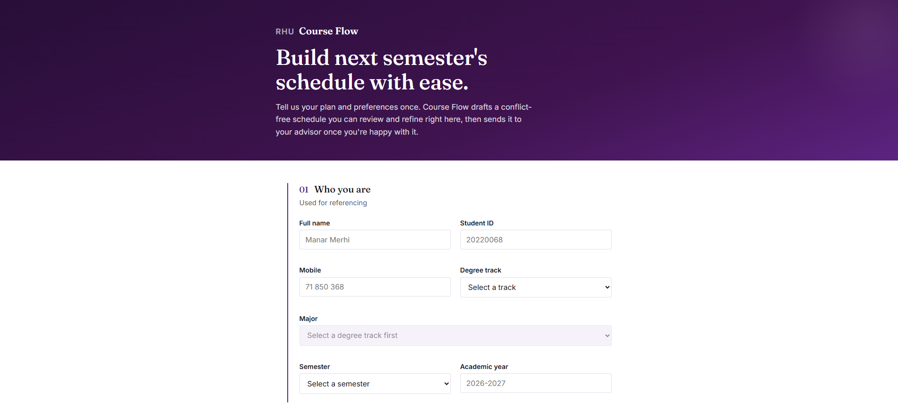
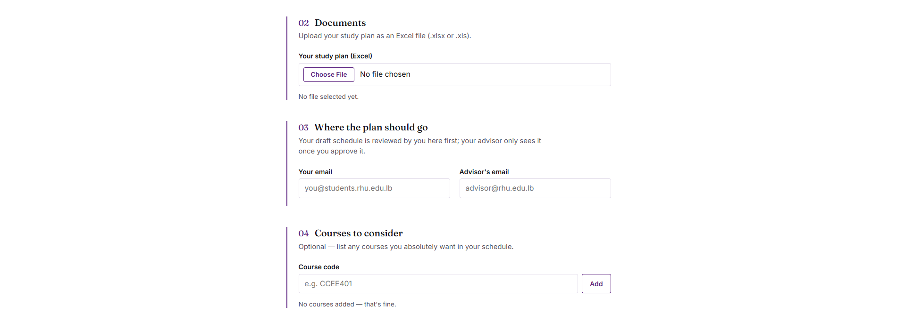 
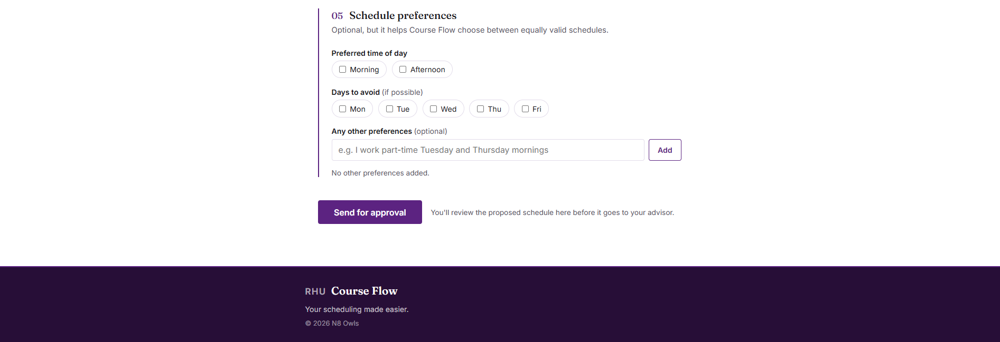 

Review Screen
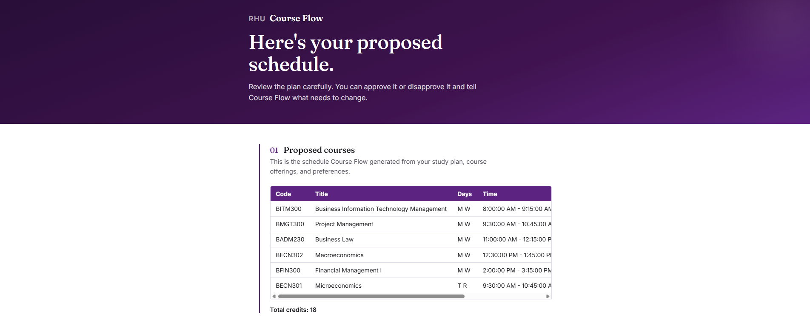
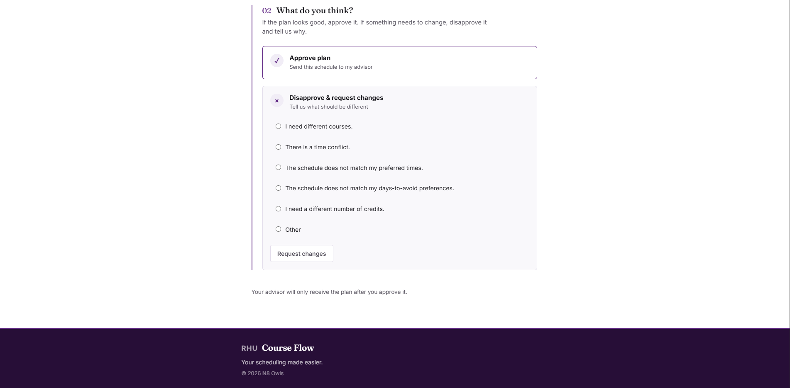

Approved Screen

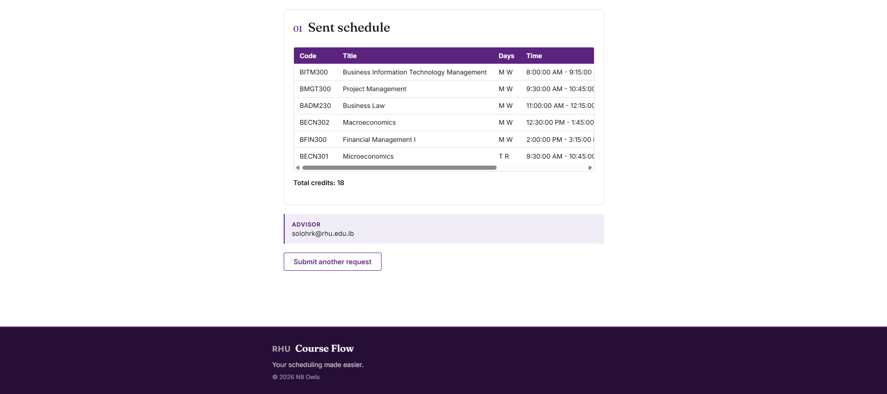

Advisor Email
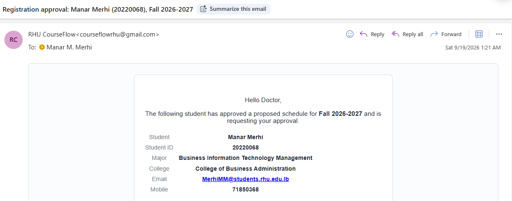
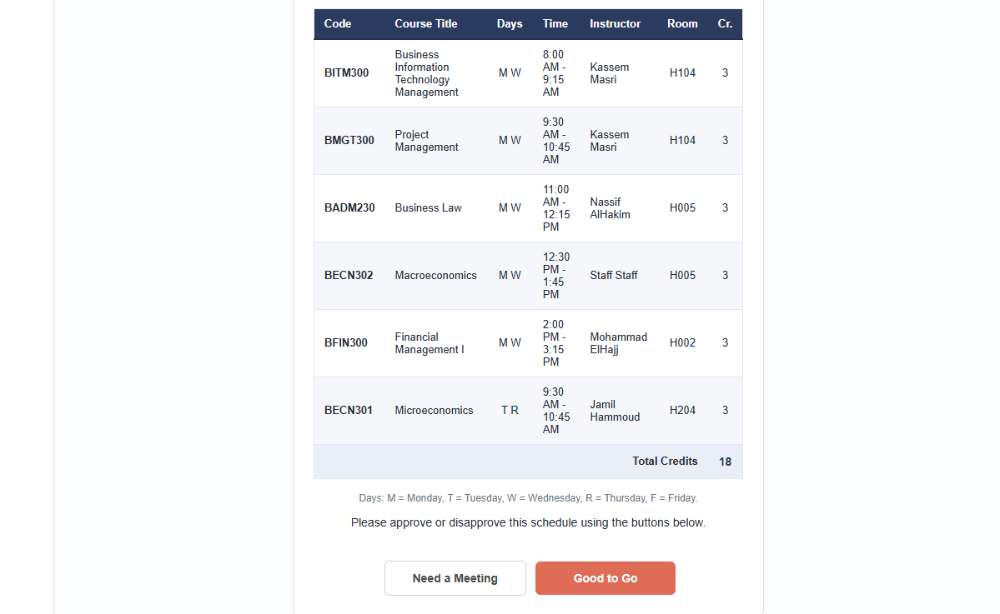

Student: Approved
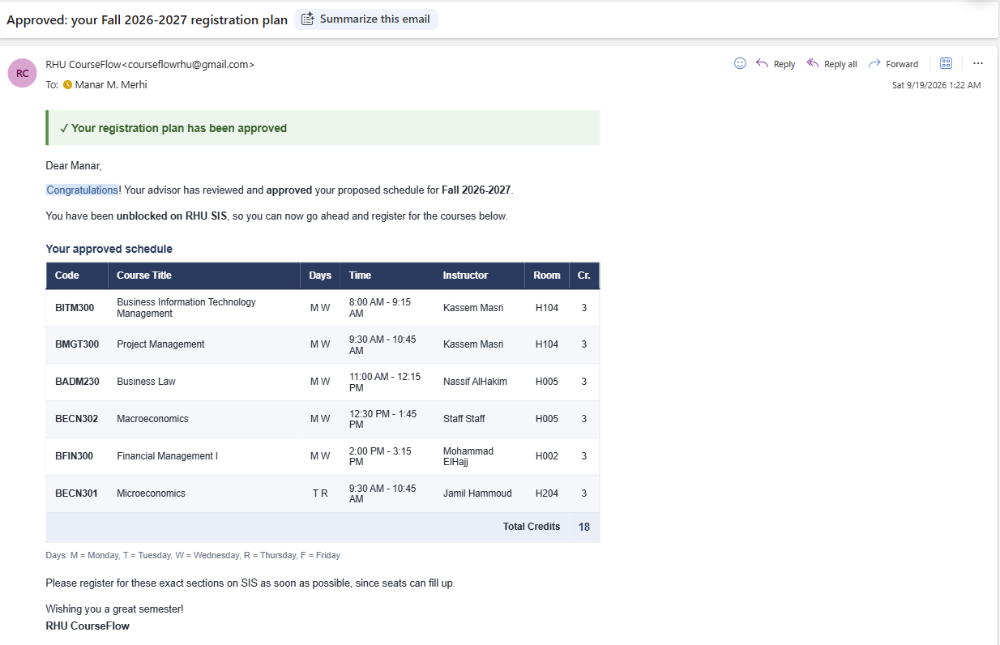

Student: Rejected
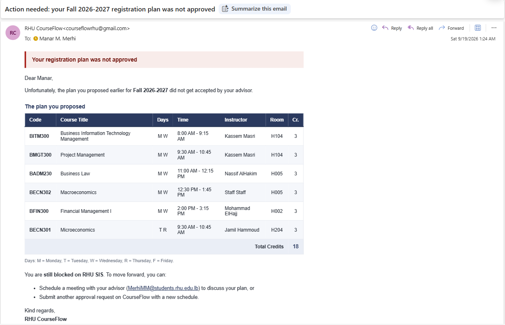

---

## 🏗️ Architecture

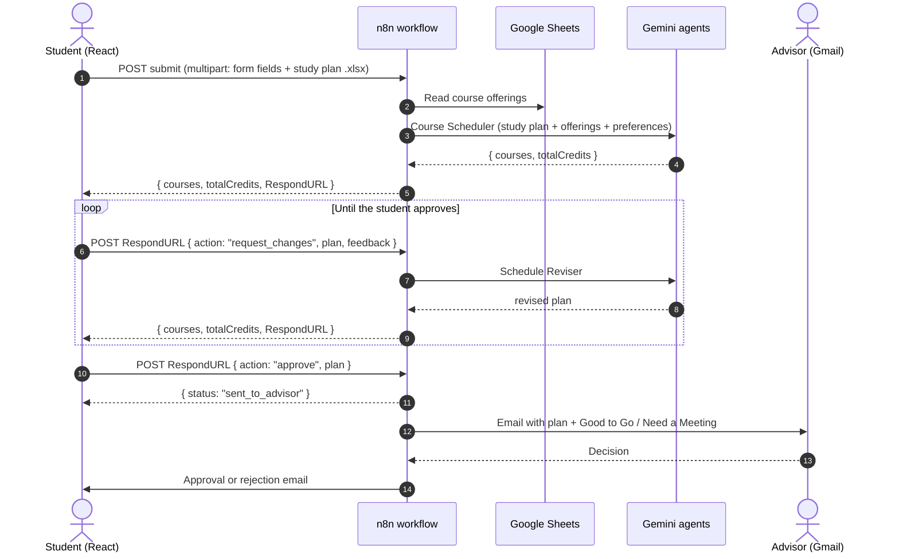

**Key design choice: one execution, one link.** The frontend calls a single fixed webhook. That execution then pauses at a **Wait** node and returns its resume link (`RespondURL`) along with the plan. Every change request and the final approval are POSTed to that link, so the whole conversation happens inside **one workflow execution**. The study plan, offerings, and student details stay available to every step without a database or session IDs.

### Tech stack

| Layer | Technology |
|---|---|
| Frontend | React, TypeScript, Vite, plain CSS |
| Automation | n8n (webhook, Wait, If, Code, Edit Fields, Aggregate, Merge, Extract from File) |
| AI | Google Gemini via n8n AI Agent nodes |
| Data | Google Sheets (course offerings), Excel upload (study plan) |
| Email | Gmail (send, and send-and-wait for advisor approval) |
| Transport | `multipart/form-data` for submit, JSON for revisions and approval |

---

## 🔧 The n8n workflow

The full workflow (24 nodes) is exported as **`AI_Bootcamp_Final.json`**.

### 1. Generate the initial plan

| Node | Type | What it does |
|---|---|---|
| **Student Submits** | Webhook (`POST /initial-submission`) | Receives the form; responds via a Respond to Webhook node |
| **Get Offerings from Database** | Google Sheets | Reads every offered section (one row each) |
| **Aggregate Offerings** | Aggregate | Collapses the rows into one `offerings` list |
| **Get Study Plan Data from upload** | Extract from File (XLSX) | Reads the uploaded `studyPlan` file |
| **Aggregate Study Plan Data** | Aggregate | Collapses the rows into one `studyPlan` list |
| **Send All info simultaneously** | Merge (combine by position) | Joins both lists into **one item**, so the agent runs once |
| **Course Scheduler** | AI Agent + Gemini | Builds the proposed schedule |
| **Parse Plan** | Edit Fields (JSON) | Parses the agent's JSON and adds `RespondURL = $execution.resumeUrl` |
| **Respond with Initial Schedule** | Respond to Webhook | Sends `{ courses, totalCredits, RespondURL }` to the frontend |

### 2. Review loop

| Node | Type | What it does |
|---|---|---|
| **Waiting for Student Revision** | Wait (on webhook call) | Pauses until the student approves or requests changes |
| **Student Approval** | If | `body.action === "approve"` → approval branch, otherwise → revision |
| **Schedule Reviser** | AI Agent + Gemini | Revises the current plan based on the feedback |
| **Parse Revised Plan** | Edit Fields (JSON) | Parses the revision and adds `RespondURL` |
| **Respond with Updated Schedule** | Respond to Webhook | Returns the revised plan, then loops back to the Wait node |

### 3. Advisor approval

| Node | Type | What it does |
|---|---|---|
| **Respond to Student (Approved)** | Respond to Webhook | Returns `{ "status": "sent_to_advisor" }` so the frontend can finish |
| **Build Advisor Email** | Code | Builds the HTML email with student details and the schedule table |
| **Email the Advisor** | Gmail (send and wait) | Approval buttons: **Good to Go** / **Need a Meeting** |
| **Advisor Approval** | If | Branches on `$json.data.approved` |
| **Build Approval Email** → **Send Approval Message** | Code → Gmail | Congratulations, SIS unblocked, final schedule |
| **Build Disapproval Email** → **Send Disapproval Message** | Code → Gmail | Plan not accepted, still blocked on SIS, next steps |

---

## 🔌 API contract

The frontend talks to n8n through **one fixed URL** and **one per-session URL**.

### Submit: `POST {VITE_N8N_SUBMIT_WEBHOOK_URL}`

`multipart/form-data`:

| Field | Type | Notes |
|---|---|---|
| `action` | string | `"submit"` |
| `fullName`, `studentId`, `mobile` | string | |
| `degreeTrack` | string | `Bachelor` or `Master` |
| `major`, `college` | string | College is derived from the major |
| `semester`, `year` | string | e.g. `Spring`, `2025-2026` |
| `email`, `advisorEmail` | string | `@students.rhu.edu.lb` / `@rhu.edu.lb` |
| `courses`, `preferredTimes`, `daysToAvoid`, `otherPreferences` | JSON string | Arrays serialized with `JSON.stringify` |
| `submittedAt` | string | ISO timestamp |
| `studyPlan` | file | `.xlsx` or `.xls` |

**Response:**

```json
{
  "courses": [
    {
      "code": "BITM300",
      "title": "Business Information Technology Management",
      "days": "M W",
      "time": "8:00:00 AM - 9:15:00 AM",
      "instructor": "Kassem Masri",
      "room": "H104",
      "credits": 3
    }
  ],
  "totalCredits": 18,
  "RespondURL": "https://<your-n8n>/webhook-waiting/<executionId>?signature=..."
}
```

`RespondURL` is stored separately in the frontend and never sent back inside `plan`.

### Request changes: `POST {RespondURL}`

```json
{
  "action": "request_changes",
  "plan": { "courses": [ ... ], "totalCredits": 18 },
  "feedback": "There is a time conflict."
}
```

**Response:** a new plan in the same shape as the submit response. If it contains a `RespondURL`, it replaces the stored one.

### Approve: `POST {RespondURL}`

```json
{
  "action": "approve",
  "plan": { "courses": [ ... ], "totalCredits": 18 }
}
```

**Response:**

```json
{ "status": "sent_to_advisor" }
```

The frontend shows the "sent to advisor" screen **only** when it receives this exact status. Any other response keeps the student on the review screen with an error.

### Plan type (frontend)

```ts
interface PlanCourse {
  code: string;
  title: string;
  days: string;
  time: string;
  instructor: string;
  room: string;
  credits: number;
}

interface ProposedPlan {
  courses: PlanCourse[];
  totalCredits: number;
}
```

---

## 📚 Data sources

### Course offerings (Google Sheet)

Course offerings are the same for every student in a semester, so they're maintained **once** in a Google Sheet instead of being uploaded with each request. Recommended layout:

- A header row in row 1, then **one row per section**. No merged cells, blank rows, or titles.
- Columns for course code, section, title, credits, faculty, days, start time, end time, room, and remarks.
- Codes written without spaces (`BITM300`), and days as single letters: `M` `T` `W` `R` `F`.
- Remarks (e.g. `Social Science`, `Humanities`, `Not open for Engineering Students`) are used by the agent for electives and eligibility.

> The registrar's PDF export uses merged cells for some courses (e.g. COSC214, MECA442, the IELP courses), so those rows lose their times when read as text. Clean them up once when building the sheet.

### Study plan (Excel upload)

| Course # | Title | Credits | Prerequisites | Status |
|---|---|---|---|---|
| Year 1, Fall Semester (16 Credits) | | | | |
| BMGT 200 | Introduction to Management | 3 | Co-req.: ENGL 210 | Completed |
| ENGL 210 | English Composition and Rhetoric | 3 | ENGL 101 | Completed |
| BADM 225 | Business Math | 3 | Placement | |
| | Social Science Elective | 3 | | |

- **`Completed`** = the student has passed the course **or is taking it this semester**. Current courses are marked Completed so they unlock their follow-up courses for the next semester.
- **Empty** = not yet taken, so it can be scheduled.
- Heading rows such as `Year 1, Fall Semester (16 Credits)` tell the agent where each course sits in the plan.

---

## 🧠 The AI agents

Both agents use Google Gemini and return **only JSON**. Their prompts share the same academic rules.

| Rule | Behavior |
|---|---|
| **Offered only** | Every section must exist in the offerings; details are copied exactly |
| **No repeats** | Courses marked `Completed` are never scheduled |
| **Prerequisites** | Satisfied only by `Completed` courses; handles `or`, `Co-req.`, `Placement`, and Junior/Senior Standing |
| **Code matching** | Ignores spaces and case; known aliases such as `BMKT 200 = BMKA200`, `BITM 305 = COSC214`, `BITM 401 = COSC333` |
| **Labs** | A lecture and its `L` lab are selected together, or not at all |
| **Electives** | Filled with offerings whose remarks match the category |
| **Eligibility** | Skips unscheduled sections, restricted remarks, and remedial courses not in the plan |
| **Time conflicts** | Every pair checked; overlapping sections on a shared day are never allowed |
| **Credits** | Max **18** in Fall/Spring, **9** in Summer; `totalCredits` must equal the sum |
| **Priorities** | Earliest unfinished plan courses → requested courses → courses that unlock others → preferred times → days to avoid |

**Course Scheduler** builds the first plan from scratch.

**Schedule Reviser** starts from the current plan and makes the smallest change that addresses the feedback: a different section first, then a different course, and only then dropping a course. Each built-in reason has explicit handling. For example, "time conflict" means fix every overlapping pair, and "preferred times" means move sections into the chosen Morning/Afternoon window.

---

## 📧 Emails

All three emails are built in **Code nodes** as inline-styled HTML tables, since email clients ignore most CSS, and sent through Gmail.

| Email | To | Content |
|---|---|---|
| **Approval request** | Advisor | Student details (name, ID, major, college, email, mobile), the schedule table, total credits, **Good to Go / Need a Meeting** buttons |
| **Approved** | Student | Green banner, congratulations, **"You have been unblocked on RHU SIS"**, final schedule, reminder to register quickly |
| **Not approved** | Student | Red banner, "the plan you proposed did not get accepted", the plan, **"still blocked on SIS"**, next steps (meet the advisor or submit a new request) |

---

## 🚀 Getting started

### Prerequisites

- **Node.js** 18+
- An **n8n** instance (cloud or self-hosted)
- A **Google Gemini API key**
- A **Google account** for Sheets and Gmail (OAuth)

### 1. Set up n8n

1. In n8n, create a new workflow and choose **⋯ → Import from File** → `AI_Bootcamp_Final.json`.
2. Create or select credentials on these nodes:
   - **Google Gemini Chat Model** and **Google Gemini Chat Model1**: Gemini API key
   - **Get Offerings from Database**: Google Sheets OAuth
   - **Email the Advisor**, **Send Approval Message…**, **Send Disapproval Message…**: Gmail OAuth
3. Point **Get Offerings from Database** at your course offerings sheet.
4. **Activate** the workflow and copy the **Production URL** from the **Student Submits** webhook.

### 2. Set up the frontend

```bash
npm install
```

Create a `.env` file in the project root:

```env
VITE_N8N_SUBMIT_WEBHOOK_URL=https://<your-n8n>/webhook/initial-submission
```

That's the only variable. Revision and approval use the `RespondURL` returned by each execution.

```bash
npm run dev
```

Open the local Vite URL, fill in the form, and upload an Excel study plan.

### 3. Test every path

1. Submit → a plan appears.
2. **Request changes** → a revised plan appears.
3. **Approve** → the "sent to advisor" screen appears, and the advisor receives the email.
4. Click **Good to Go** once and **Need a Meeting** once, and check both student emails.

---

## 🗂️ Project structure

```text
.
├── index.html
├── package.json
├── tsconfig.json
├── vite.config.ts
├── .env                         # VITE_N8N_SUBMIT_WEBHOOK_URL
├── AI_Bootcamp_Final.json       # n8n workflow export
├── README.md
├── docs/
│   ├── n8n-workflow.png
│   └── screenshots/
│
└── src/
    ├── App.tsx
    ├── main.tsx
    │
    ├── Components/
    │   ├── Course FlowForm.tsx   # state, validation, API calls, phase switching
    │   ├── CourseForm.tsx       # the form layout
    │   ├── ReviewScreen.tsx     # plan review + approve / request changes
    │   ├── ApprovedScreen.tsx   # "sent to advisor" confirmation
    │   ├── PlanTable.tsx        # schedule table
    │   ├── Hero.tsx, Footer.tsx, Wordmark.tsx
    │   ├── Section.tsx, SectionHeader.tsx, ErrorBanner.tsx
    │   └── sections/
    │       ├── WhoYouAreSection.tsx     # 01 personal + academic info
    │       ├── DocumentsSection.tsx     # 02 Excel study plan upload
    │       ├── DestinationSection.tsx   # 03 student + advisor emails
    │       ├── CoursesSection.tsx       # 04 courses to consider
    │       └── PreferencesSection.tsx   # 05 times, days to avoid, other
    │
    ├── lib/
    │   ├── config.ts        # webhook URL from .env
    │   ├── constants.ts     # tracks, semesters, time blocks, days, change reasons
    │   ├── majors.ts        # majors → colleges
    │   ├── formState.ts     # initial form state
    │   ├── validation.ts    # all field rules
    │   ├── plan.ts          # normalizePlan, RespondURL, approval check, postJson
    │   └── types.ts         # FormState, ProposedPlan, …
    │
    └── CSS/                 # one stylesheet per component
```

---

## 🛡️ Front-End Validation

Everything below is checked before submission. The **Send for approval** button does nothing until every field is valid, and errors appear under each field.

| Field | Rule |
|---|---|
| Full name | Required |
| Student ID | 5–10 digits |
| Mobile | 7–15 characters: digits, `+`, `-`, spaces |
| Degree track / Major / Semester | Required (a major needs a track first) |
| Academic year | `YYYY-YYYY` |
| Study plan | Required, `.xlsx` or `.xls` |
| Student email | Must end in `@students.rhu.edu.lb` |
| Advisor email | Must end in `@rhu.edu.lb` |

Days to avoid can be chosen from **Mon–Fri**, and preferred times are **Morning** or **Afternoon**.

---

## 👥 Team & license

Built for the RHU AI Bootcamp, team N8 Owls: **Manar Merhi, Adel lhussein, Aseel Ghaith, and Limar Al Asadi**.

© 2026 Manar Merhi, Adel lhussein, Aseel Ghaith, and Limar Al Asadi. All rights reserved.